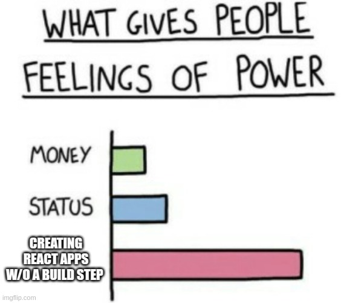
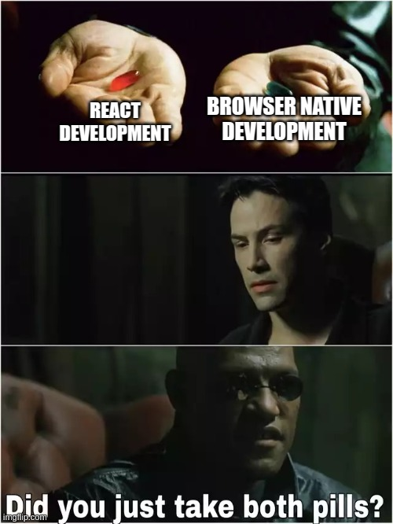
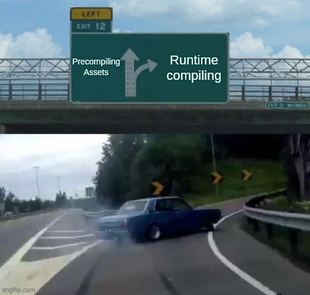

# Build more, bundle less.

Run JSX from plain HTML while the idea is still small and the bundler has not found your address yet.

Bundless is for React demos, docs, prototypes, and static pages that should start with a file server instead of a build pipeline. Serve the files, write the component, and move to a bundler only when the project actually raises its hand.

**Bundless.js**: 36Kb Acorn runtime for JSX. Need TypeScript or TSX? Use Sucrase: 52Kb.

[Usage Docs](https://bundless.dev/usage.html) · [Playground](https://bundless.dev/playground.html) · [Migration](https://bundless.dev/migration.html) · [Benchmarks](https://bundless.dev/benchmarks.html) · [GitHub](https://github.com/karpatic/bundless)

## Getting Started

Serve a plain HTML file over HTTP, then add one app script and one Bundless runtime.

External JSX:

```html
<div id="react-root"></div>
<script src="./App.jsx" type="text/jsx"></script>
<script src="./dist/bundless.acorn.min.js" type="module"></script>
```

Inline JSX:

```html
<div id="react-root"></div>
<script type="text/jsx">
  ReactDOM.render(<h1>Hello from Bundless.</h1>, document.getElementById("react-root"));
</script>
<script src="./dist/bundless.acorn.min.js" type="module"></script>
```

TSX:

```html
<script src="./App.tsx" type="text/jsx"></script>
<script src="./dist/bundless.sucrase.min.js" type="module"></script>
```

The page needs React available too. The [Usage Docs](https://bundless.dev/usage.html) show the tiny import map when your JSX imports packages by name, because opening the homepage with a JSON blob would be rude.

Acorn is the small default. Sucrase handles JSX plus TypeScript. Babel, Meriyah, prefetching, and the rest are in the docs. When production constraints call for a build, use the [Webpack migration guide](https://bundless.dev/migration.html).

## Memes

<div style="display: flex; flex-wrap: wrap; gap: 10px; justify-content: center;">
  
  
  
</div>
